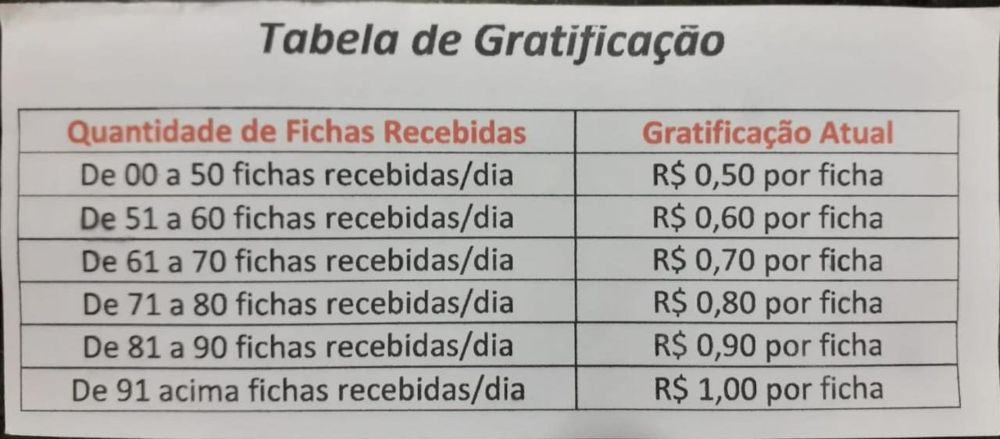
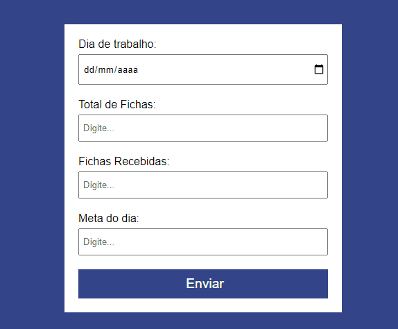
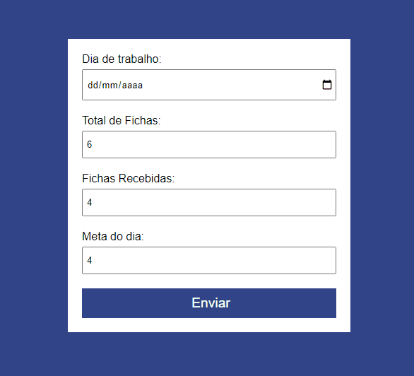

# Projeto ComissaoTrabalho
 
ComissaoTrabalho é um simples projeto criado para ajudar meu pai. Ao final de casa mês é calculada uma comissão de acordo com a quantidade de fichas entregues. Então, fiz o ComissaoTrabalho para que calcule as comissões diárias. Deve tá achando um pouco confuso, mas vou deixar uma imagem de como é calculada essa comissão diária:

No formulário tem alguns campos importantes: Total de Fichas; Fichas Recebidas e Meta do Dia.

Ao preencher os campos e aperta no botão enviar, será aberto uma nova janela com as informações do dia e outras informações:

E por fim, após o envio, todas as informaçõe~s são direcionadas a uma planilha criada pelo Google Planilhas.